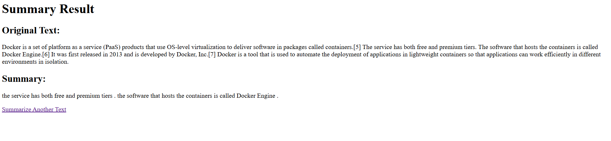
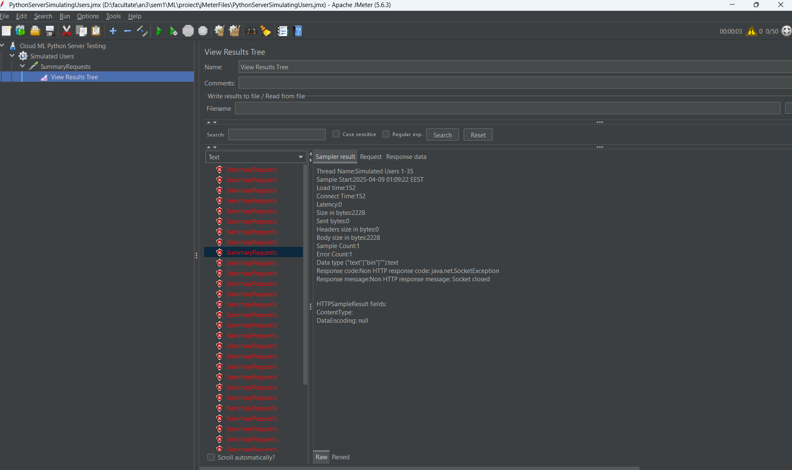
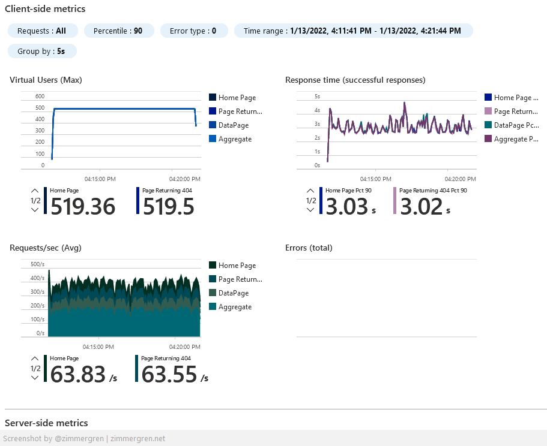

# O analiza asupra load testarii prin Azure Load Testing

## Aplicatie demo

Drept aplicatie demo contra careia sa se efectueze testele de performanta este o aplicatie de tip REST scrisa in Python cu Flask care utilizeaza un model de IA descarcat local sa sumarizeze text dat de catre utilizator. Formatul aplicatiei este unul simplu, insa care ofera destula complexitate computationala si relationala (initializarea aplicatiei prin descarcarea modelului de pe hugging face) astfel incat sa ofere o analiza asupra eficientei scalarii aplicatiei pentru un numar mare de utilizatori concomitenti.

Interfata oferita de aplicatie este una simpla, aceasta fiind trimisa direct in format HTML de catre server, astfel asigurandu-se o eficienta din acest punct de vedere.

Pe langa detaliile mentionate anterior, aplicatia este containerizata folosind Docker pentru a putea fi scalata si deployata in cloud, sau pe local, printr-un orchestrator precum Kubernetes. Un cluster de kubernetes rulat local va fi realizat prin Kind.

## Documentatie aplicatie

Modelul de IA folosit: https://huggingface.co/google-t5/t5-base
Documentatie pentru modulul Flask: https://python-adv-web-apps.readthedocs.io/en/latest/flask.html
Documentatia pentru Docker: https://docs.docker.com/reference/ (include documentatia si pentru containere, si pentru engine-ul care le ruleaza)
Documentatia pentru Kubernetes: https://kubernetes.io/docs/home/
Documentatia pentru Kind: https://kind.sigs.k8s.io/

# Exemplu din aplicatie

## Testele de performanta

Contra aplicatiei descrise anterior vrem sa rulam teste de performanta care sa masoare capacitatea acesteia de a gestiona un numar mare de utilizatori concomitenti. Deoarece aplicatia include si o complexitate computationala ridicata, aceasta performanta trebuie masurata si validata contra unor teste care sa reflecte abilitatea, sau inabilitatea, infrastructurii de a gestiona un numar mare de request-uri.

Aceste teste de performanta vor fi realizate prin instrumentul JMeter, bazat pe java, care simuleaza utilizatori creand thread-uri, fiecare utilizator simulat fiind un thread, care trimit request-uri si cronometreaza si analizeaza raspunsurile primite. De asemenea, este important si "locul" de unde sunt rulate testele - de pe aceeasi masina, de pe o alta masina din aceeasi retea, de pe o alta masina complet izolata trecand prin internet.

## Documentatie testare de performanta

Documentatie pentru JMeter: https://jmeter.apache.org/usermanual/index.html

# Exemplu de test din JMeter

## Azure Load Testing

Serviciile care vor fi mentionate in cadrul acestui proiect sunt cele oferite de catre Azure, acestia oferind un serviciu numit Azure Load Testing. Acesta are ca scop simularea unui numar mare de utilizatori, mai mare decat cel care poate fi facut de pe o masina locala. Acesta ofera posibilitatea de a simula utilizatori si de a rula teste care au comportamentul definit asemenea unui plan de testare scris pentru JMeter.

Astfel, acest serviciu beneficiaza de robustibilitatea si de efortul depus in instrumentul JMeter. De asemenea, acest serviciu ofera si o integrare nativa cu alte servicii oferite de Azure, precum Azure Kubernetes Service si alte componente, permitand, de exemplu, rularea testelor in aceeasi retea ca serviciul testat. Acest lucru poate fi dorit pentru a evita diverse verificari sau interdictii care ar putea fi puse asupra request-urilor primite din internet.

Azure Load Testing primeste de la utilizator un plan de testare scris in formatul JMeter. In urma acestui plan, sunt configurate alte elemente de securitate, iar dupa aceea, planul de testare este incarcat pe un numar ales de ACI-uri - Azure Container Instances ( instante de containere Docker ) - care sa simuleze utilizatorii si comportamentul acestora.

Beneficiul este ca Azure poate controla unde si pe ce masini sa ruleze aceste ACI-uri pentru a oferi un cost cat mai mic, umpland goluri pe masinile ocupate de alte servicii, si ofera si metrici native pentru serviciile testate, cum ar fi AKS.

In cadrul acestui proiect, voi demonstra utilitatea serviciului oferit de cei de la Microsoft, cat si o reproducere a acestuia folosind instrumente open-source (Docker).

De asemenea, toate serviciile si instructiunile realizate in Azure vor fi facute procedural, prin limbajul lor de Infrastructure as Code, Bicep.

# Exemplu de test rulat in Azure Load Testing

## Documentatie pentru cloud

Documentatie pentru Azure: https://learn.microsoft.com/en-us/azure/?product=popular
Documentatie pentru Azure Load Testing: https://learn.microsoft.com/en-us/azure/load-testing/
Documentatie pentru Bicep: https://learn.microsoft.com/en-us/azure/azure-resource-manager/bicep/
Demo pentru Azure Load Testing: https://www.youtube.com/watch?v=oKSFrkSkcZo
Documentatie pentru Azure Container Instance: https://learn.microsoft.com/en-us/azure/container-instances/
