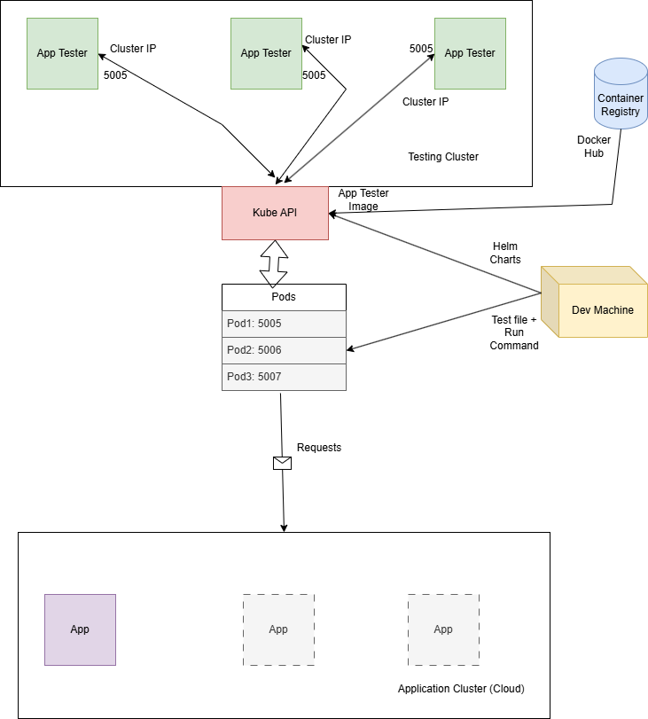

# O analiza asupra load testarii prin Azure Load Testing

## Aplicatie demo

Drept aplicatie demo contra careia sa se efectueze testele de performanta este o aplicatie de tip REST scrisa in Python cu Flask care utilizeaza un model de IA descarcat local sa sumarizeze text dat de catre utilizator.

Formatul aplicatiei este unul simplu, insa care ofera destula complexitate computationala si relationala (initializarea aplicatiei prin descarcarea modelului de pe hugging face) astfel incat sa ofere o analiza asupra eficientei scalarii aplicatiei pentru un numar mare de utilizatori concomitenti.

Interfata oferita de aplicatie este una simpla, aceasta fiind trimisa direct in format HTML de catre server, astfel asigurandu-se o eficienta din acest punct de vedere.

Pe langa detaliile mentionate anterior, aplicatia este containerizata folosind Docker pentru a putea fi scalata si deployata in cloud, sau pe local, printr-un orchestrator precum Kubernetes. Un cluster de kubernetes rulat local va fi realizat prin Kind.

De asemenea, pentru a accentua si pentru a valida faptul ca request-urile ajung la aplicatie, am adaugat o pagina unde se poate vizualiza numarul de request-uri satisfacute de aplicatie, cat si resetarea acestui contor.

## Documentatie aplicatie

Modelul de IA folosit: https://huggingface.co/google-t5/t5-base

Documentatie pentru modulul Flask: https://python-adv-web-apps.readthedocs.io/en/latest/flask.html

Documentatia pentru Docker: https://docs.docker.com/reference/ (include documentatia si pentru containere, si pentru engine-ul care le ruleaza)

Documentatia pentru Kubernetes: https://kubernetes.io/docs/home/

Documentatia pentru Kind: https://kind.sigs.k8s.io/

# Exemplu din aplicatie

## Testele de performanta

Contra aplicatiei descrise anterior vrem sa rulam teste de performanta care sa masoare capacitatea acesteia de a gestiona un numar mare de utilizatori concomitenti.

Deoarece aplicatia include si o complexitate computationala ridicata, aceasta performanta trebuie masurata si validata contra unor teste care sa reflecte abilitatea, sau inabilitatea, infrastructurii de a gestiona un numar mare de request-uri.

Aceste teste de performanta vor fi realizate prin instrumentul JMeter, bazat pe java, care simuleaza utilizatori creand thread-uri, fiecare utilizator simulat fiind un thread, care trimit request-uri si cronometreaza si analizeaza raspunsurile primite.

De asemenea, este important si "locul" de unde sunt rulate testele - de pe aceeasi masina, de pe o alta masina din aceeasi retea, de pe o alta masina complet izolata trecand prin internet.

## Documentatie testare de performanta

Documentatie pentru JMeter: https://jmeter.apache.org/usermanual/index.html

# Exemplu de test din JMeter

## Azure Load Testing

Serviciile care vor fi mentionate in cadrul acestui proiect sunt cele oferite de catre Azure, acestia oferind un serviciu numit Azure Load Testing.

Acesta are ca scop simularea unui numar mare de utilizatori, mai mare decat cel care poate fi facut de pe o masina locala. Acesta ofera posibilitatea de a simula utilizatori si de a rula teste care au comportamentul definit asemenea unui plan de testare scris pentru JMeter.

Astfel, acest serviciu beneficiaza de robustibilitatea si de efortul depus in instrumentul JMeter. De asemenea, acest serviciu ofera si o integrare nativa cu alte servicii oferite de Azure, precum Azure Kubernetes Service si alte componente, permitand, de exemplu, rularea testelor in aceeasi retea ca serviciul testat.

Acest lucru poate fi dorit pentru a evita diverse verificari sau interdictii care ar putea fi puse asupra request-urilor primite din internet.

Azure Load Testing primeste de la utilizator un plan de testare scris in formatul JMeter. In urma acestui plan, sunt configurate alte elemente de securitate, iar dupa aceea, planul de testare este incarcat pe un numar ales de ACI-uri - Azure Container Instances ( instante de containere Docker ) - care sa simuleze utilizatorii si comportamentul acestora.

Beneficiul este ca Azure poate controla unde si pe ce masini sa ruleze aceste ACI-uri pentru a oferi un cost cat mai mic, umpland goluri pe masinile ocupate de alte servicii, si ofera si metrici native pentru serviciile testate, cum ar fi AKS.

In cadrul acestui proiect, voi demonstra utilitatea serviciului oferit de cei de la Microsoft, cat si o reproducere a acestuia folosind instrumente open-source (Docker, Kubernetes, Kind).

De asemenea, toate serviciile si instructiunile realizate in Azure vor fi facute procedural, prin limbajul lor de Infrastructure as Code, Bicep.

# Exemplu de test rulat in Azure Load Testing

# Diagrama pentru rularea testelor cu Azure Load Testing

## Documentatie pentru cloud

Documentatie pentru Azure: https://learn.microsoft.com/en-us/azure/?product=popular

Documentatie pentru Azure Load Testing: https://learn.microsoft.com/en-us/azure/load-testing/

Documentatie pentru Bicep: https://learn.microsoft.com/en-us/azure/azure-resource-manager/bicep/

Demo pentru Azure Load Testing: https://www.youtube.com/watch?v=oKSFrkSkcZo

Documentatie pentru Azure Container Instance: https://learn.microsoft.com/en-us/azure/container-instances/

## Descriere aplicatie de testare cu numar mare de utilizatori

Aplicatia a fost scrisa in python si are 2 functionalitati principale: cea de incarcare a unui fisier jmx pentru a fi rulat, si cea de start a testului.

Aceste doua functionalitati sunt menite sa ofere o similaritate cat mai mare fata de solutia oferita de Azure Load Testing. Aplicatia python scrisa in Flask este containerizata, iar pentru eficienta maxima, este rulata in cadrul unui cluster pentru o gestionare mai usoara a masinilor care sa ruleze testele de performanta.

Container-ul rezultat este incarcat pe Docker Hub pentru a putea fi descarcat mai usor de catre pod-uri, asigurand un acces general al container-ului la imaginea de docker.

Pentru demonstratie, aplicatia este rulata pe un cluster de Kubernetes local prin Kind, in exemplul meu fiind 3 pod-uri ale acestei imagini.

API-ul de python este folosit pentru interactiunea cu jmeter, aplicatia de testare fiind descarcata in imaginea de docker care este rulata pe cluster si fiind folosita in continuare pentru a realiza simularea de utilizatori.

Pentru a asigura comportamentul dinamic al aplicatiei, aceasta se foloseste de Helm charts pentru a realiza copii de pod-uri care sa foloseasca imaginea de testing app.

Pentru simplitate, am realizat un script in bash care automat aplica Helm chart-urile create de un numar de ori configurat in script. Urmatorul pas este validarea pod-urilor, verificand ca acestea sunt Ready.

Dupa acest pas, expunem fiecare pod in parte pe un port pentru a putea fi accesate pe rand. Dupa aceasta expunere, pe rand este incarcat fisierul de test pe fiecare pod, iar dupa aceea este rulat testul pe interg cluster-ul.

## Documentatie pentru aplicatia de testare

Documentatie pentru Helm: https://helm.sh/docs/

# Diagrama aplicatie

In cadrul diagramei, avem 3 componente principale:

+ Dev Machine: calculatorul de pe care se vor trimite helm chart-urile si vor fi incarcate fisierele de test si date comenzile de run

+ Testing Cluster: cluster-ul unde sunt rulate toate instantele de testing app si din care vor iesi toate request-urile trimise pentru aplicatie

+ Application Cluster: cluster-ul unde se afla aplicatia

Tabela "Pods" reprezinta asocierea unui port cu un anume pod. Aceasta asociere este folosita de dev machine pentru a putea trimite fiecarui pod individual fisierul de test si comanda de run.

De asemenea, Kube API este responsabil de aceasta mapare de port-uri prin care se trece, de exemplu, de la portul 5007 la portul 5005 de pe adresa IP a pod-ului 3.

Imaginea aplicatiei este descarcata de pe un container registry, in demo fiind folosit Docker Hub.

## Video Demo

https://youtu.be/GltF5t-4KM0

## Exemplu diagrama pentru testare cu aplicatia de testare

## Concluzii tehnice

Pentru o functionalitate cat mai buna a acestei aplicatii, numarul de pod-uri care sunt instantiate ar trebui sa fie egal cu numarul de nod-uri pe care cluster-ul le are. JMeter este menit sa foloseasca la potentialul maxim masina pe care ruleaza, astfel ca numarul de instante care ar trebui rulat concomitent este recomandat sa fie egal cu numarul de masini de care beneficiaza cluster-ul.

De asemenea, o provocare in realizarea acestui proiect a reprezentat-o adunarea de metrici de pe pod-urile care rulau testele. Astfel, rezultate ar putea fi extrase doar dupa finalizarea testului. In acest moment, singurele metrici care pot fi extrase sunt cele de pe masina pe care ruleaza aplicatia care este testata.

Un factor relevant pentru rezultate care sunt obtinute este de asemenea si locul de unde sunt rulate testele. Azure Load Testing ne ofera varianta ori sa rulam testele de pe o retea separata, pachetele trecand astfel prin internet pana la aplicatie, sau sa rulam de pe aceeasi retea virtuala cu aplicatia noastra.

Un avantaj semnificativ pe care il au containerizarea si deployment-ul prin Kubernetes este support-ul oferit de cloud provideri. Astfel, aplicatia de testare poate fi incarcata prin AKS si rulata pe masinile celor de la Azure in aceeasi retea virtuala cu aplicatia de testat, sau poate fi rulat local de pe o masina cu multe core-uri, pachetele trecand prin internet.

## Folosirea tool-urilor AI

Acestea au fost foarte de folos in cautarea de documentatie si in ghidarea spre o solutie corecta pentru diversele probleme aparute in rezolvarea temei.

Desi ideea era descrisa mai mult sau mai putin coerent de mine, modelele de LLM au fost foarte de folos in cautarea in documentatie a diverselor posibilitati prin care as putea ajunge la o solutie.

De asemenea, Github Copilot a fost foarte de folos in rezolvarea unor probleme care tineau de documentatie si care reprezentau bug-uri mici, eficientizand mult procesul de dezvoltare al aplicatiei.

